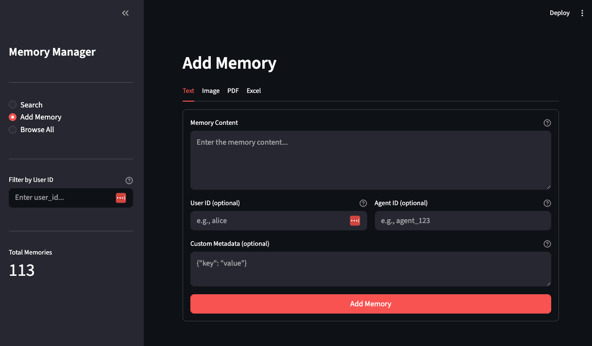
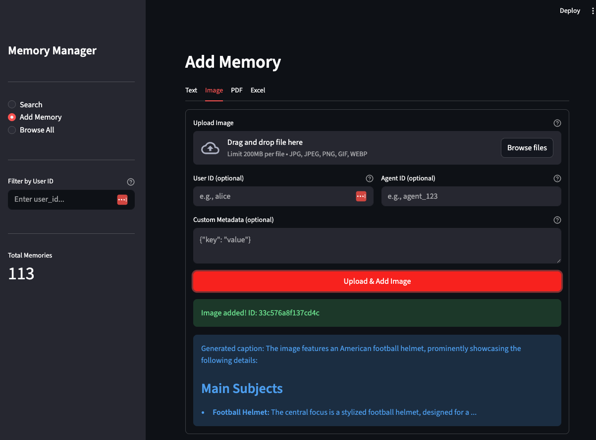
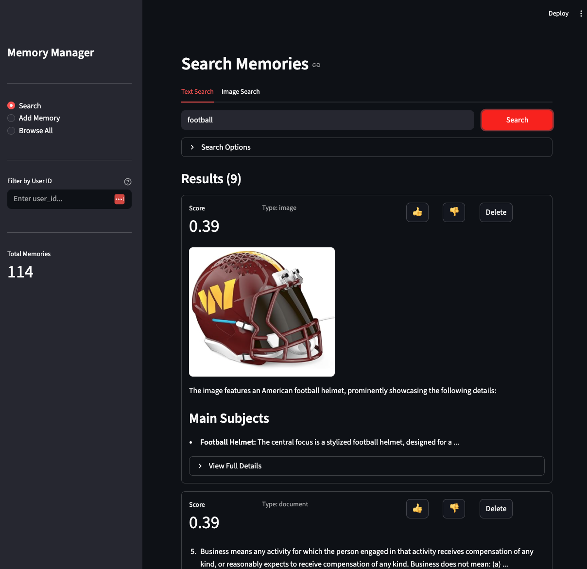

# Memory

**Universal memory for AI agents.** Store, search, and retrieve context across sessions, tools, and models — so your agents actually remember.

---

## The Problem

Every AI agent today has amnesia. The moment a session ends, everything is gone — user preferences, past decisions, project context, critical facts. The next session starts from scratch.

This isn't a minor UX issue. It's a fundamental limitation that keeps AI agents from being truly useful in real-world workflows:

- **Your coding agent** doesn't remember that you prefer tabs over spaces, or that the production database has a quirk with timestamps.
- **Your support agent** asks the same clarifying questions every single time, even for a customer it's "talked to" a hundred times.
- **Your workflow agent** can't learn from its own mistakes because it literally cannot recall making them.

We build agents with access to the most powerful language models ever created, then give them the memory of a goldfish.

## Why This Matters

Memory isn't a nice-to-have — it's the difference between a tool and a teammate.

Agents without persistent memory cannot:
- Build up context over time about a user, project, or domain
- Avoid repeating past mistakes
- Maintain consistency across sessions
- Coordinate with other agents that share the same user

**Universal agent memory** — memory that works across models, tools, and sessions — is infrastructure that every serious agent deployment will need. It's the missing layer between the LLM and the application.

This project is an opinionated take on what that layer should look like: semantic search over chunked, multi-modal content, stored locally, with a dead-simple API.

## Three Ways to Use It

Memory meets you where you are. Pick the interface that fits your workflow:

| | Interface | Best For |
|---|---|---|
| **Python Client** | `from app.client import Memory` | Embedding memory directly into your agent code. Import, call, done. |
| **REST API** | FastAPI on `localhost:8000` | Integrating from any language or framework. Language-agnostic access for production deployments. |
| **Web App** | Streamlit on `localhost:8501` | A sandbox to explore and play around. Add memories, run searches, and see results instantly — no code required. Great for demos, debugging, and getting a feel for what semantic memory can do. |

## Batteries Included

No external services to provision. No infrastructure to manage. Install, run, and you have a working memory system. Everything runs locally, starts in seconds, and stays lightweight.

- **Semantic Search** — Find memories by meaning, not keywords. "What does the user prefer?" matches "Alice likes dark mode and compact layouts."
- **Auto-Chunking** — Intelligent content-type-aware chunking for emails, chats, and documents. No manual preprocessing.
- **Multi-Modal** — Text, images (with auto-captioning via GPT-4V), and PDFs. Because context isn't just text.
- **Local-First** — ChromaDB-backed. Your data stays on your machine. No cloud database required.
- **Fast & Lightweight** — Minimal dependencies. Sub-second search over thousands of memories.

## Screenshots

**Search memories by meaning** — type a natural language query and get ranked results across text, images, and documents.


**Add memories from any source** — text, images, PDFs, and Excel files. Each content type gets intelligent chunking automatically.



**Image upload with auto-captioning** — drop in an image and it generates a searchable description via GPT-4V. The image becomes findable by what it contains.



**Semantic search results** — search for "football" and find the helmet image you uploaded, alongside relevant documents. Relevance scores, inline previews, and feedback controls.



## Quick Start

### Prerequisites

- Python 3.11+
- OpenAI API key

### Installation

```bash
git clone <repo-url>
cd mem

python -m venv .venv
source .venv/bin/activate  # On Windows: .venv\Scripts\activate

pip install -r requirements.txt

cp .env.example .env
# Edit .env and add your OPENAI_API_KEY
```

### Create `.env` file

```env
OPENAI_API_KEY=sk-your-key-here
API_KEY=can_be_whatever_not_really_checking
```

### Run

```bash
# Web UI
streamlit run web/app.py        # http://localhost:8501

# API Server
uvicorn app.main:app --reload   # http://localhost:8000/docs
```

## Usage

### Python Client

```python
from app.client import Memory

m = Memory()

# Add memories
m.add("User prefers dark mode", user_id="alice")
m.add("Meeting scheduled for Friday at 3pm", user_id="alice", metadata={"type": "calendar"})

# Search by meaning
results = m.search("user preferences", user_id="alice")
for r in results:
    print(f"{r['score']:.2f}: {r['content']}")

# Images and documents
m.add_image(image_path="screenshot.png", user_id="alice")
m.add_pdf(file_path="report.pdf", user_id="alice")

# Full CRUD
m.get_all(user_id="alice")
m.update(memory_id="abc123", content="Updated content")
m.delete(memory_id="abc123")
```

### Auto-Detecting Chunker

The system detects content type and applies the right chunking strategy automatically:

```python
# Email — strips quotes and signatures, sentence-based chunking
m.add(email_content, content_type="email")

# Chat — groups messages into conversation windows
m.add(chat_log, content_type="chat")

# Document — paragraph-aware chunking with overlap
m.add(document_text, content_type="document")
```

| Content Type | Chunk Size | Behavior |
|---|---|---|
| `email` | 1500 chars | Strips quotes and signatures |
| `chat` | 800 chars | Conversation windows, max 10 messages |
| `document` | 2000 chars | Paragraph-aware, 200 char overlap |
| `image` | N/A | GPT-4V captioning |
| `pdf` | 2000 chars | Page-aware extraction |

## API Reference

| Method | Description |
|---|---|
| `add(content, user_id, agent_id, metadata)` | Add text memory with auto-chunking |
| `add_image(image_path, image_bytes, user_id)` | Add image with auto-captioning |
| `add_pdf(file_path, file_bytes, user_id)` | Add PDF with text extraction |
| `search(query, user_id, limit)` | Semantic search |
| `search_image(image_path, image_bytes, user_id)` | Find similar images |
| `get(memory_id)` | Get single memory |
| `get_all(user_id, limit)` | List memories |
| `update(memory_id, content, metadata)` | Update memory |
| `delete(memory_id)` | Delete memory |
| `delete_all(user_id)` | Delete all memories for user |
| `count(user_id)` | Count memories |

## Project Structure

```
mem/
├── app/
│   ├── client.py           # Memory client (main interface)
│   ├── config.py           # Settings management
│   ├── main.py             # FastAPI application
│   ├── core/
│   │   ├── chunker.py      # Auto-detecting text chunker
│   │   ├── embeddings.py   # OpenAI embedding service
│   │   ├── pdf_parser.py   # PDF text extraction
│   │   └── vision.py       # Image captioning (GPT-4V)
│   ├── api/
│   │   └── routes/         # API endpoints
│   └── models/
│       └── schemas.py      # Pydantic models
├── web/
│   ├── app.py              # Streamlit entry point
│   └── components/         # UI components
├── tests/
├── requirements.txt
└── README.md
```

## Tech Stack

- **Vector DB**: ChromaDB
- **Embeddings**: OpenAI text-embedding-3-small
- **Vision**: GPT-4o-mini
- **API**: FastAPI
- **Web UI**: Streamlit
- **PDF**: pypdf

## Development

```bash
pip install -r requirements.txt

# Run tests
pytest

# With coverage
pytest --cov=app --cov-report=html
```

### Adding a New Content Type

1. Create parser in `app/core/`
2. Add chunking strategy in `app/core/chunker.py`
3. Add method to `app/client.py`
4. Update web UI in `web/components/`
5. Write tests in `tests/`

## License

MIT
